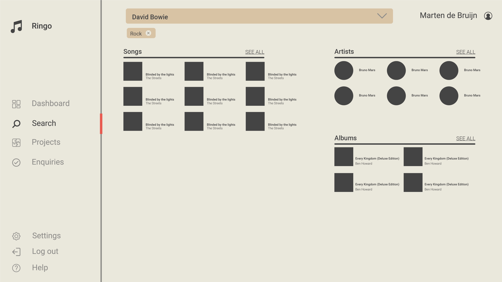

# Look and feel

# How does [Ringo.pro](http://ringo.pro) has to look?

- Clean
- Simple
- Refreshing
- Easy to use
- Easy to use and clean data input fields; like [typeform](https://www.typeform.com/product/).
- Organize information; like [soundcharts](https://soundcharts.com/).
- The Apple iPod changed the way we viewed music,
  letting the album art become the visual iconography
  for the app. This clean look/feel is something our users
  expect in a music library.

**Competitors:**

- [SyncFloor](https://orpheus.syncfloor.com/)
- [Disco](https://disco.ac/)

# Components

Ringo has three main components/workspaces: search, projects and enquiries.

## Search workspace

Search is where we are going to look for, listen to and playlist music through the ears of a Music Supervisor, and find out more information about songs and artists that can help inform creative decisions. Playlists is where we store our creative searches.

In the search workspace you got:

- Search input
- Search results
- Stream music content
- View additional song information

## Projects workspace

Projects is where we collect and organize all of the project information.

In the projects workspace you got:

- Projects overview
- Project
- Contracts
- Payments

## Enquiries workspace

Enquiries functions like a task manager with messaging/communications functions, actionable items and notifications.

In the enquiries workspace you got:

- Enquiries Overview
- Enquiries Detail (single)

# Inspiration

**[Linglee - Languages learning platform by Aga Ciurysek](https://dribbble.com/shots/7052720-Linglee-Languages-learning-platform/attachments/53324?mode=media)**

**[Form Screen Accounting Appointment by Semas](https://dribbble.com/shots/8045347-Form-Screen-Accounting-Appointment)**

**Note** the checkboxes on the most left phone.

**[Dashboards: Showcase 2019](https://www.behance.net/gallery/88895219/Dashboards-Showcase-2019?tracking_source=search_projects_recommended%7Cdata%20ui)**

# Interesting end points of the Spotify API

- Album
- Tracks
- Artist
- Duration
- Tempo
- Danceability
- Energy
- Instrumentalness
- Explict
- Is_playable
- Popularity

# First sketches

I hadn't had the time to finish them. So some of the sketches are a little bit skewed and don't have the correct font-size.

**Dashboard**

**Search**

  

**Search results**

  

